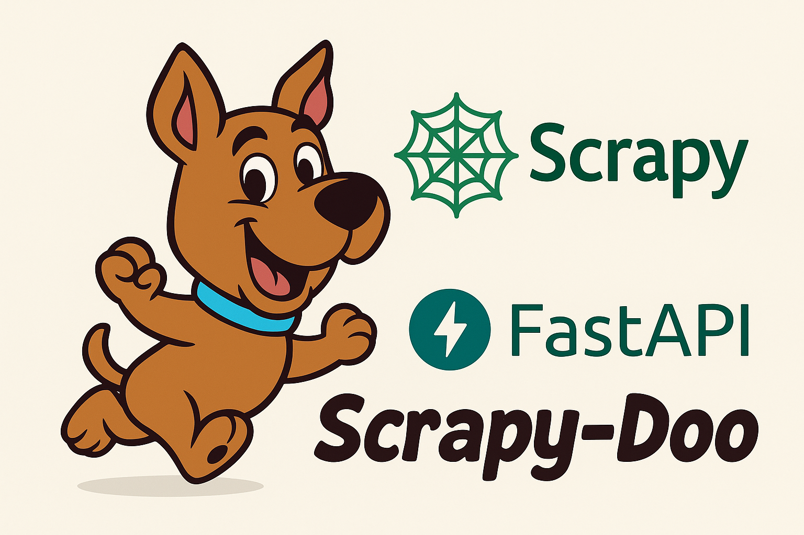
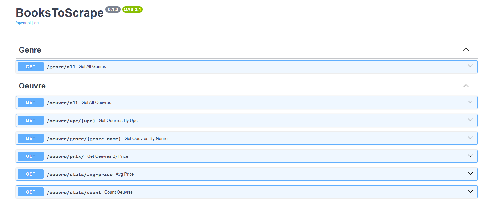
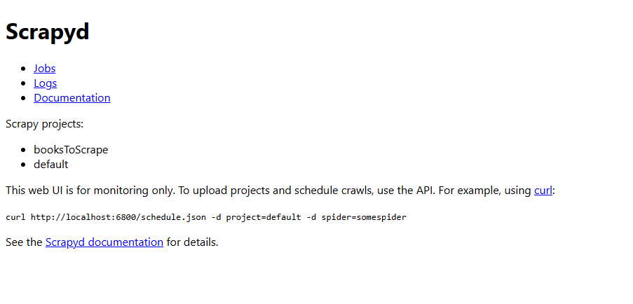
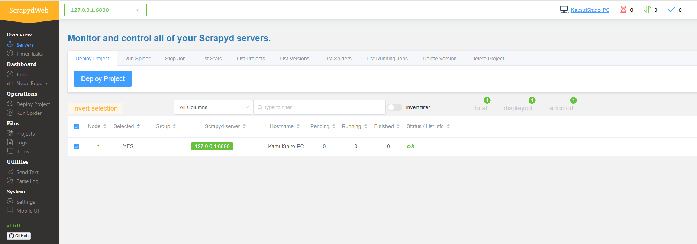

# scrappy_BooksToScrape



[](https://choosealicense.com/licenses/mit/)


scrappy_BooksToScrape est un projet complet de collecte, stockage et exposition de données basé sur plusieurs technologies:

- **Scrapy**
 pour le web scraping : extraction automatisée des livres à partir du site Books to Scrape
.

- **PostgreSQL**
 comme base de données relationnelle pour stocker les genres, les œuvres et les journaux de scraping.

- **FastAPI**
 pour créer une API REST performante qui permet d’interagir avec les données collectées.

- **Scrapyd** et **ScrapydWeb**
 pour le déploiement, la planification et le suivi des spiders Scrapy.

L’objectif est de construire une chaîne complète de traitement des données :
Récupération des informations (titres, prix, genres, etc.) depuis Books to Scrape.

Nettoyage, transformation et enregistrement dans une base PostgreSQL.

Mise à disposition via une API REST FastAPI.

Monitoring et gestion des spiders avec ScrapydWeb.

## Sommaire

1) [Installation](README/installation.md)
2) [Base de données](README/bdd.md)
3) [FastAPI](README/fastAPI.md)
4) [Scrapy](README/scrapy.md)
5) [Scrapyd et Scrapydweb](README/scrapyd_scrapydweb.md)

## Structure principal du projet

```bash
│
├── booksToScrape/               # Contient le code Scrapy, Scrapyd et ScrapydWeb
│
├── fastApi/                     # Contient le code FastAPI
│
├── README/                      # Dossier regroupant les pages détaillées du README
│   ├── images/                  # Ressources (bannières, captures d'écran, etc.)
│   ├── bdd.md                   # Documentation sur la base de données
│   ├── fastAPI.md               # Documentation sur FastAPI
│   ├── installation.md          # Guide d’installation
│   ├── scrapy.md                # Documentation sur Scrapy
│   └── scrapyd_scrapydweb.md    # Documentation sur Scrapyd & ScrapydWeb
│
├── LICENSE
├── README.md                    # Documentation principale
├── requirements_scrapydweb.txt  # Dépendances pour l’environnement `.venv_scrapydweb`
└── requirements.txt             # Dépendances pour l’environnement `.venv`

```

## URL
- Lien Books to Scrape: https://books.toscrape.com/
- FastAPI: http://localhost:8000
- Scrapyd: http://127.0.0.1:6800
- Scrapydweb: http://127.0.0.1:5000

## Capture d'écran

*interface FastAPI*


*interface Scrapyd*


*interface Scrapydweb*


## Licence
Ce projet est sous licence MIT — voir le fichier LICENSE.