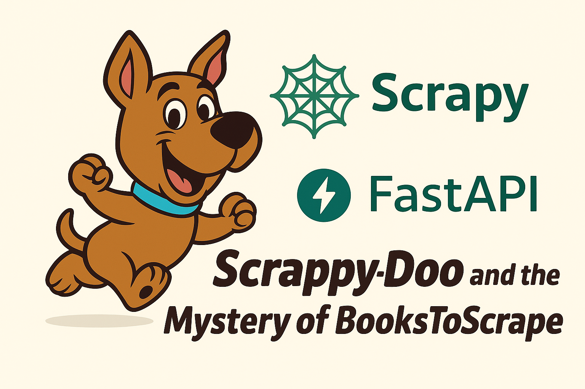

# scrappy_BooksToScrape

## Sommaire

1) [Installation](README/installation.md)
2) [Base de données](README/bdd.md)
3) [FastAPI](README/fastAPI.md)
4) [Scrapy](README/scrapy.md)
5) [Scrapyd et Scrapydweb](README/scrapyd_scrapydweb.md)

## Structure du projet

## Capture d'écran

## Licence