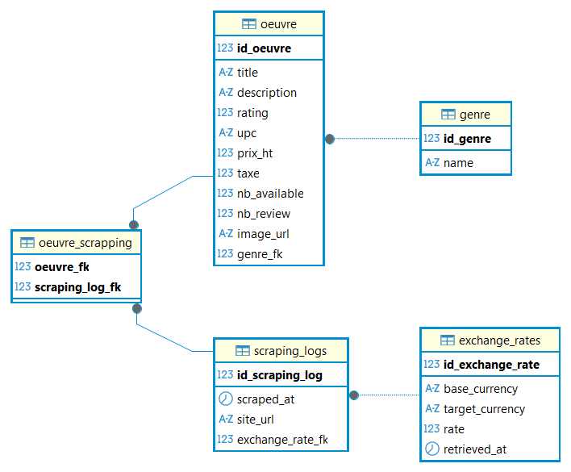

# Base de données

## Dictionaire de données

### Table `genre`

|Colonne|Type|Description|
|---|---|---|
|id_genre|int PK|Identifiant unique du genre|
|name|str|Nom du genre (ex: Science-Fiction, Thriller)|

### Table `oeuvre`

|Colonne|Type|Description|
|---|---|---|
|id_oeuvre|int PK|Identifiant unique de l’œuvre|
|title|str|Titre du livre|
|description|text|Résumé ou description|
|rating|int|Note (0–5)|
|upc|str|Code produit unique|
|prix_ht|float|Prix hors taxes (en GBP)|
|taxe|float|Montant de la taxe|
|nb_available|int|Nombre d’exemplaires disponibles|
|nb_review|int|Nombre de critiques|
|image_url|str|URL de l’image|

### Table `scraping_logs`
|Colonne|Type|Description|
|---|---|---|
|id_scraping_log|int PK|Identifiant unique du scraping|
|scraped_at|datetime|Date et heure du scraping|
|site_url|str|URL du site scrappé|
|exchange_rate_fk|int FK|Référence vers le taux de change utilisé|

### Table `scraping_logs`
|Colonne|Type|Description|
|---|---|---|
|id_exchange_rate|int PK|Identifiant unique|
|base_currency|str|Devise de départ (ex: GBP)|
|target_currency|str|Devise cible (ex: EUR)|
|rate|float|Taux de conversion|
|retrieved_at|datetime|Date de récupération du taux|

### Table `oeuvre_scraping`
|Colonne|Type|Description|
|---|---|---|
|oeuvre_fk|int PK FK|Référence vers `oeuvre.id_oeuvre`|
|scraping_log_fk|int PK FK|Référence vers `scraping_logs.id_scraping_log`|
|created_at|datetime|Date du lien œuvre-scraping|

## MCD



## MPD

```SQL
-- TABLE genre;

CREATE TABLE public.genre (
	id_genre serial4 NOT NULL,
	"name" varchar NOT NULL,
	CONSTRAINT genre_pkey PRIMARY KEY (id_genre)
);

-- TABLE oeuvre;

CREATE TABLE public.oeuvre (
	id_oeuvre serial4 NOT NULL,
	title varchar NOT NULL,
	description varchar NULL,
	rating int4 NOT NULL,
	upc varchar NOT NULL,
	prix_ht float8 NOT NULL,
	taxe float8 NOT NULL,
	nb_available int4 NOT NULL,
	nb_review int4 NOT NULL,
	image_url varchar NOT NULL,
	genre_fk int4 NOT NULL,
	CONSTRAINT oeuvre_pkey PRIMARY KEY (id_oeuvre),
	CONSTRAINT oeuvre_genre_fk_fkey FOREIGN KEY (genre_fk) REFERENCES public.genre(id_genre)
);

-- TABLE exchange_rates;

CREATE TABLE public.exchange_rates (
	id_exchange_rate serial4 NOT NULL,
	base_currency varchar NOT NULL,
	target_currency varchar NOT NULL,
	rate float8 NOT NULL,
	retrieved_at timestamp NOT NULL,
	CONSTRAINT exchange_rates_pkey PRIMARY KEY (id_exchange_rate)
);

-- TABLE scraping_logs;

CREATE TABLE public.scraping_logs (
	id_scraping_log serial4 NOT NULL,
	scraped_at timestamp NOT NULL,
	site_url varchar NOT NULL,
	exchange_rate_fk int4 NOT NULL,
	CONSTRAINT scraping_logs_pkey PRIMARY KEY (id_scraping_log),
	CONSTRAINT scraping_logs_exchange_rate_fk_fkey FOREIGN KEY (exchange_rate_fk) REFERENCES public.exchange_rates(id_exchange_rate)
);

-- TABLE oeuvre_scrapping;

CREATE TABLE public.oeuvre_scrapping (
	oeuvre_fk int4 NOT NULL,
	scraping_log_fk int4 NOT NULL,
	CONSTRAINT oeuvre_scrapping_pkey PRIMARY KEY (oeuvre_fk, scraping_log_fk),
	CONSTRAINT oeuvre_scrapping_oeuvre_fk_fkey FOREIGN KEY (oeuvre_fk) REFERENCES public.oeuvre(id_oeuvre),
	CONSTRAINT oeuvre_scrapping_scraping_log_fk_fkey FOREIGN KEY (scraping_log_fk) REFERENCES public.scraping_logs(id_scraping_log)
);
```